[【电子科大】离散数学——代数、群与格部分\_哔哩哔哩\_bilibili](https://www.bilibili.com/video/BV1En4y1X7Cc/?spm_id_from=333.337.search-card.all.click&vd_source=953ed9c88ca9a2031bf250a5919089bc)
## 格
#### 定义：偏序集任意两个元素都有最小上界和最大下界就是格
哈斯图看出来
链也是格

>[!example] 正整数上的整除关系
>幂集上的包含关系
>n的因子

#### 哈斯图
考虑验证图中不可比的几个元素是否有最大下界和最小上界
>[!example] 

#### 自然运算
定义求最小上界和最小上界为两个运算
定理10.1格的两个运算满足
1) 交换律
2) 幂等律
3) 结合律
	1) 

>[!代数格]-
>

代数格-》偏序格

### 格的性质
对偶格，对偶格是等价的，对偶原，保序性，分配不等式， 

### 子格和理想
>[!子格的定义]-
>只要满足非空和封闭，
>所有子格和空集可以构成子格格

>[!判断]-
>

理想：所有包含

### 分配格
满足分配律，
幂集格和命题格都是
链也是分配格，

birkhoff判定定理：充分必要，没有任何子格和钻石格和五角格同构

满足格的消去律

这样就有两个判定定理

模格，分配格都是模格，除了

### 有界格和有补格

通过哈斯图计算补员的方法

有补分配格，有补，唯一，
邱求补运算满足双重否定和的摩根率

## 环和域

满足+为可换群，`*`，为半群，满足分配律
+单位元称为零元，负元，倍数
乘法：单位元，逆元，幂

减法：$a-b=a+(-b)$
零元有性质：$0a = a 0 = 0$
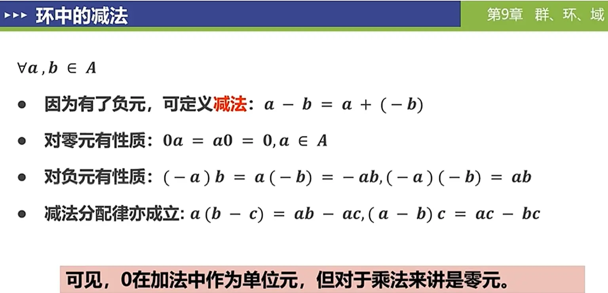

零因子：

域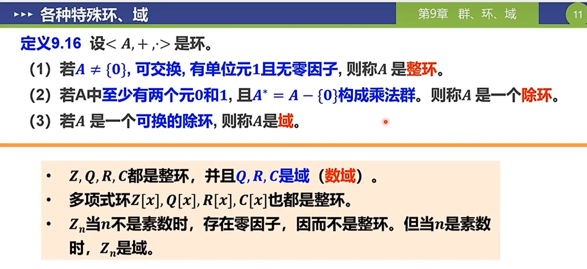

定理：$<Z_{n},+,\cdot>$是域的充要条件是素数。

### 自环：
$<A,+,*>$是一个环，S是A的一个非空子集切也构成环，那么S是A的一个自环，A是S的扩环。

两个平凡子环

自环的判定：设S是环A的一个非空子集，则S是A的子环的充要条件是对$\forall a,b \in S$有$a - b \in S$ ,和$ab \in S$

理想：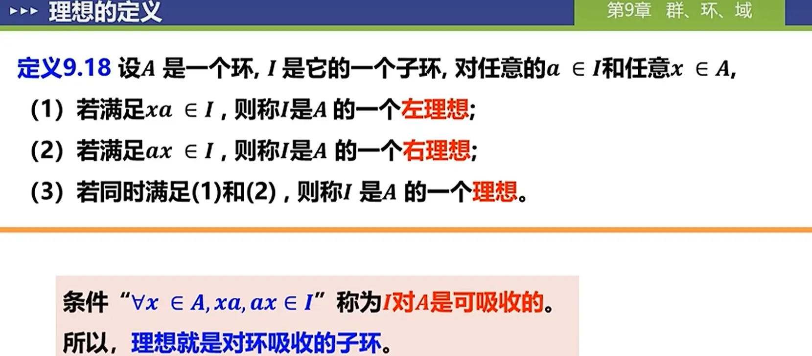

判定：充分必要条件：子环和可吸收

商环：

# 代数
## 运算
### 二元运算
>[!note] 常见二元运算
>

#### 定义二元运算
运算表

### 一元运算到n元运算

## 代数系统
定义：

判定：若要证明`< A,*1,*2,…，*m>`是代数系统，就是证明以下两点：
 （1）集合A非空：通常是找到某一个元素$a\in A$。
(2）各运算*；（i=1,2，…,m）关于A是封闭的:即证明$\forall x,y \in A,x*y \in A$。

### 代数系统的关系
#### 同类型
运算个数相同

#### 子代数
定义：

任何代数系统都有子代数

>[!子代数的证明]-
>

### 二元运算律
交换律和结合律
>[!define]-
>

幂等律和消去律
>[!define]-
>

>[!运算律的判定]-
判定：
>1) 使用定义
>2) 使用运算表
分配律和吸收律

判定
>[!example]-
>

### 特殊元
>[!单位元define]- 

定理8.1 有左右单位元，则单位元存在且唯一

>[!零元define]- 
>

定理：存在左右零元，则左右零元相等且唯一

>[!逆元]- 
>
>>[!定理]-
>>

>[!判定特殊元]-
>>定义运算；
>>运算表：
>>> [!example]- 特殊元的判定
>>>
>>>
>>> 
>>> 
>>>

### 同态和同构
>[!define]-
>

**判定：建立同态映射**

>[!定理]-

>[!满同态的性质]-
>

## 群

>[!define]- 
>

证明流程：
>[!tips]-
>

### 典型群
1. 数群：
	1. 整数，有理数，实数，复数上的加法
	2. 有理数，实数，复数去零上的乘法
>[!info]-
>

2. Klein四元群
3. 整数模n同余类加法群

4. 整数模n同余类乘法群：注意$Z_{n}*$满足欧拉函数
>[!proof]- 
>

5. 对称群
>[!proof]-
>

6. N次全线性群

### 群的性质
>[!define]-
>

群的幂
>[!define]-
>

只有一个元素的群，那个元素一定是单位元也是零元

### 元素的阶
>[!define]-
>

>[!实数的阶conclusion]-
>

>[!tldr]- 元素的阶的性质
>

### 子群
定义：子群，平凡子群，真子群
>[!define]-
>

子群的单位元和逆元和原来的群一样

>[!子群的判定]-
>
>>[!exmaple]-
>

>[!有限子群的判定]-
>

>[!子群的性质（保守性）]-
>

### 群的同态和同构
>[!define]-
>

判断同构：首先判断都是群，然后找对应关系的函数

>[!性质]-
>
>>[!proof]-
>>1）群中只有单位元是唯一的幂等元

## 特殊群
### 循环群
>[!define]-
>

>[!example]-
>
>>[!结论]-
>>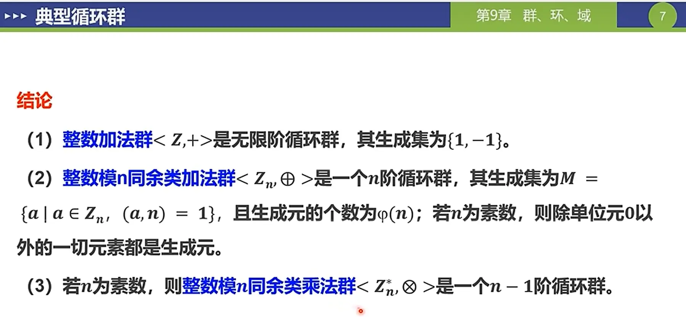

>[!性质]-
>定理9.7 是循环群，则是阿贝尔群
>定理9.8 有限群G是循环群，当且仅当G中至少存在一个元素a，有|a| = |G|（阶相等，可用来证明循环群）
>
>>[!循环群的同构]-
>>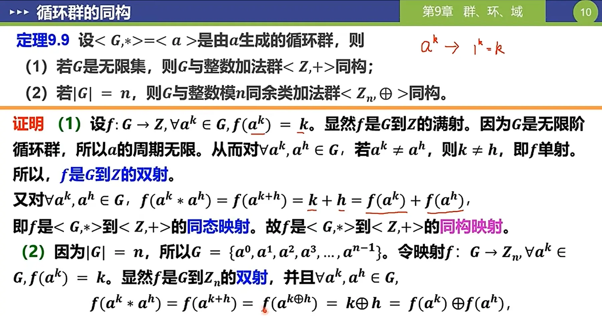

>[!循环群的子群]-
>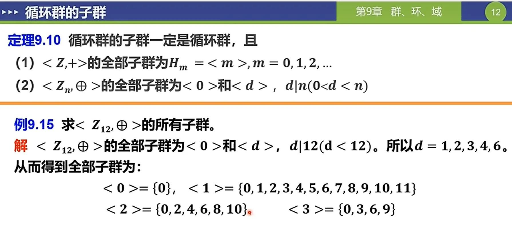
>>[!结论]-
>>

### 置换群
#### 对称群

>[!轮换]-
>

>[!置换的分解]-
>>[!定理9.11]-
>>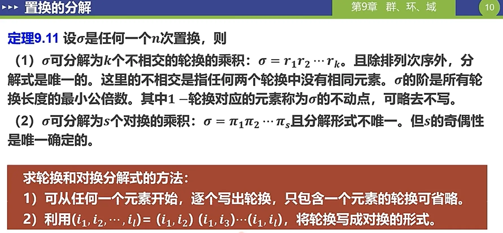
>>>[!exanple]-
>>>

>[!置换的奇偶性]-
>>[!define]-
>>

>[!置换的类型]-
>

>[!典型的置换群]
>>[!二面体群]-
>>
>
>>[!example]-
>>
>>
>>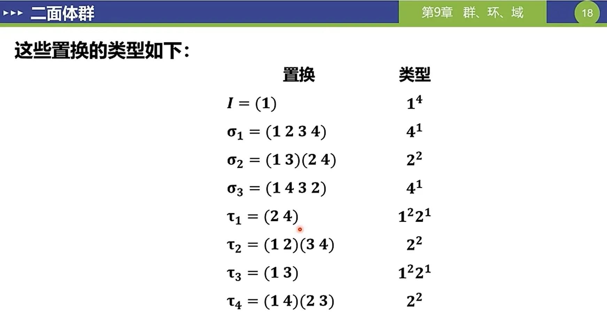
>>
>>

>[!凯莱定理]-
>G是任意一个群，则：
>1. G同构于一个变换群
>2. 若G是有限群，则G同构于一个置换群

## 陪集

>[!等价关系]-
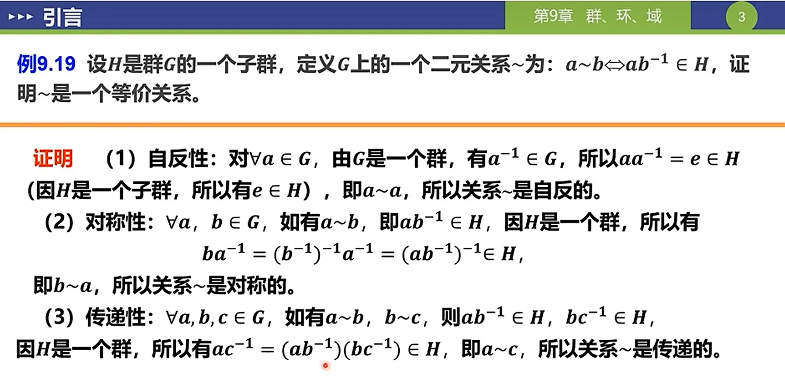

>[!培集的定义]-

>>[!example]-
>>
>
>

>[!培集的性质]-
>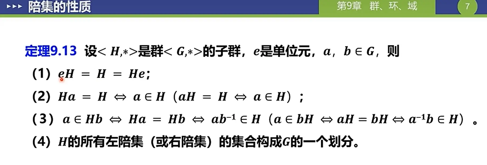

>[!求所有培集的方法]-
>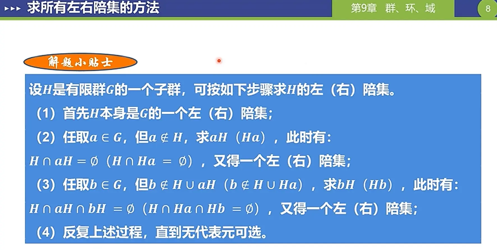
>>[!example]-
>>

>[!定理]-
>
>利用h把群分为n个组

[9.3.1陪集\_哔哩哔哩\_bilibili](https://www.bilibili.com/video/BV1En4y1X7Cc?spm_id_from=333.788.player.switch&vd_source=953ed9c88ca9a2031bf250a5919089bc&p=13)

### 拉格朗日定理
>[!定理]-
>
>>[!推论]-
>>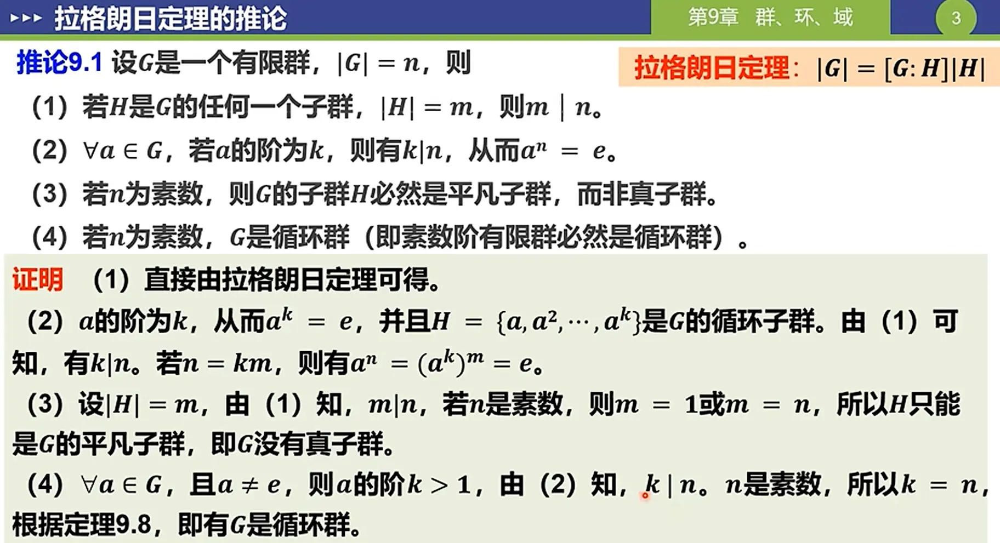

?

## 正规子群

>[!define]-
>

>[!正规子群的判定]-
>1. 使用定义。证明左右培集相等
>2. 使用定理
>>[!example]-
>>

### 商群 

所有陪集
商集关于·构成群，证明封闭性，证明唯一性，结合律，单位元， 
