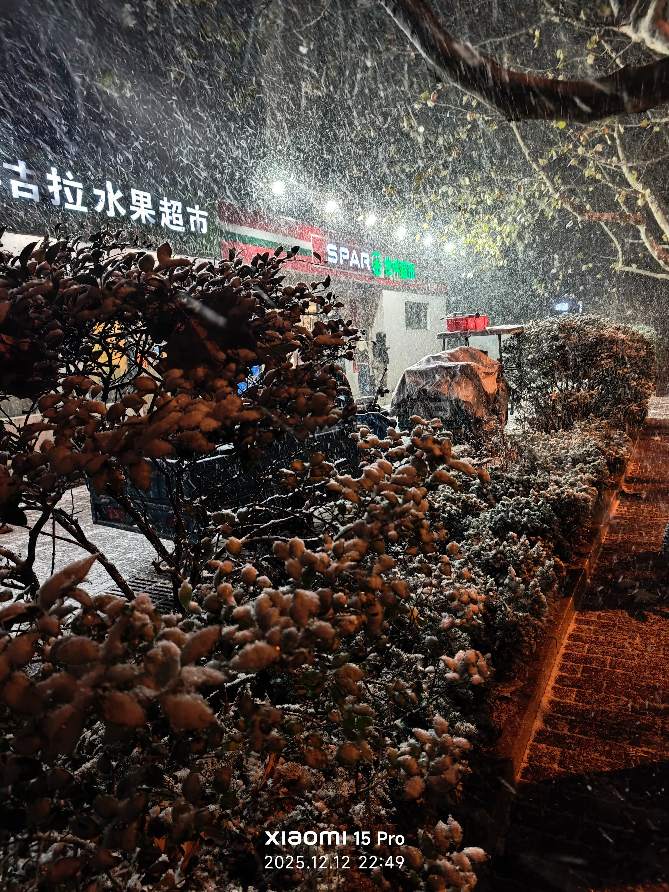
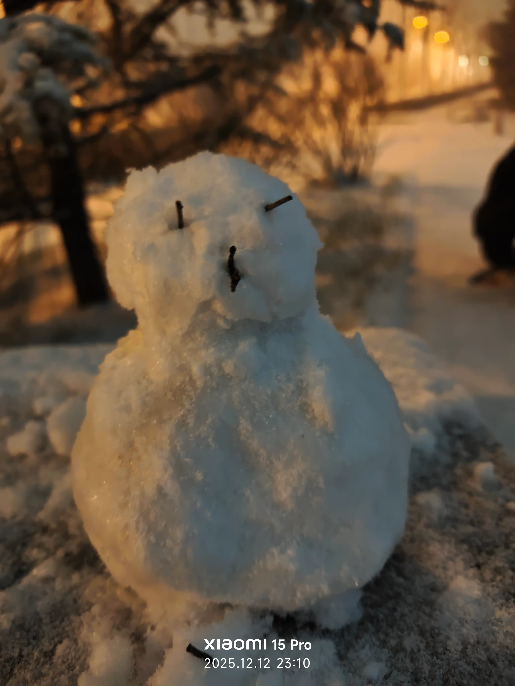
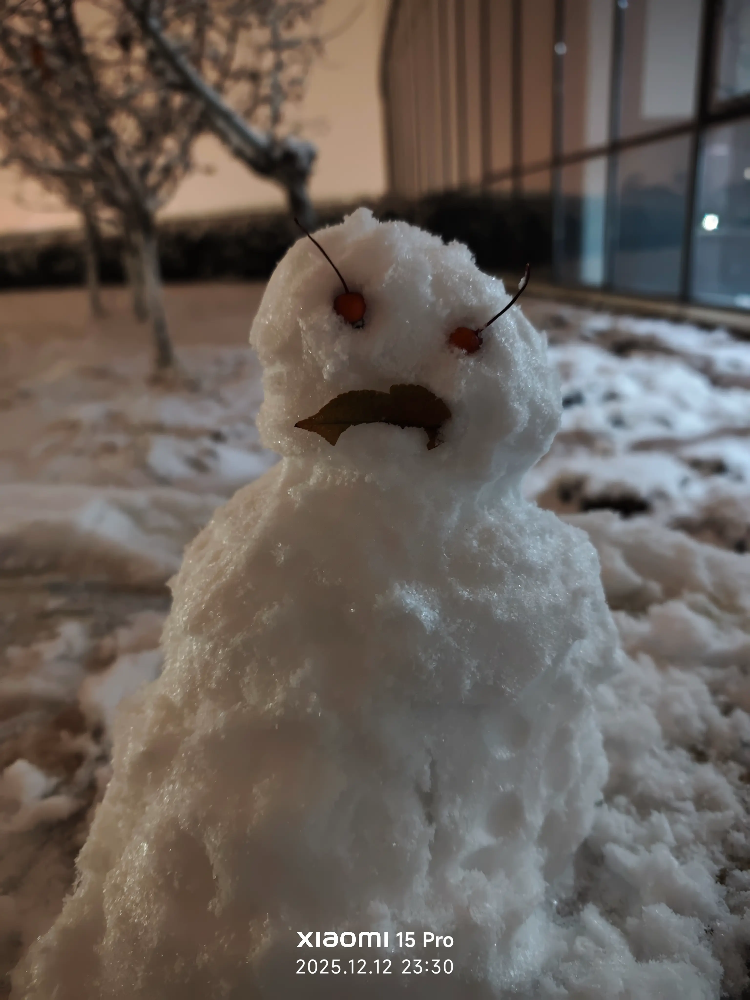

---

### 我今天感觉如何？

下午睡到4点过，补题一道题，写了篇题解
这是我一生中见到的最大的雪，不一会就堆满了大地，我滚了一个小雪球，堆雪人。我走上图书馆，人迹罕至，雪夜寂静，地上厚厚的雪还没有脚印，我躺下去，很快就感觉到寒冷，这时候就应该和某个爱的人一起在雪夜中漫步，但是我还是孤孤单单的一个人，在这个时刻难免感到寂寞。

晚上下大雪，风雪中睁不开眼睛，堆雪人，躺在雪地，从雪地上滚下来都体验了

### 我最困扰的是什么？有没有一点点缓解？
