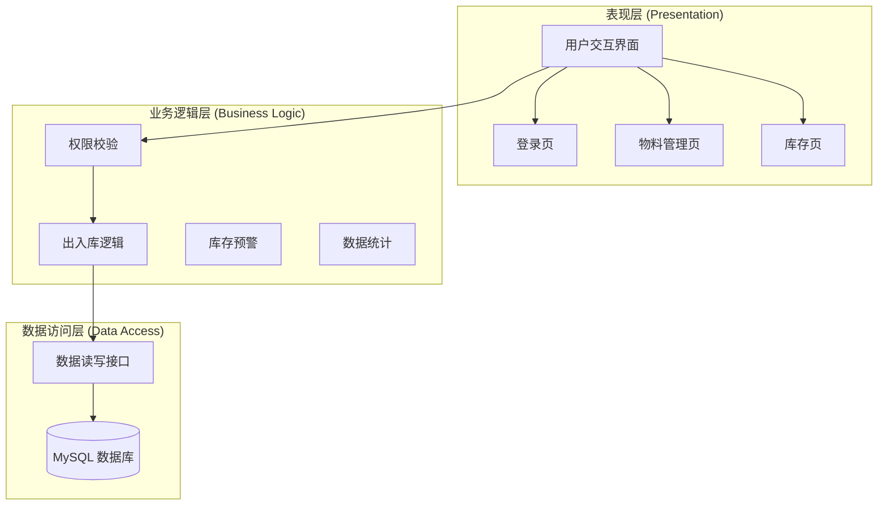

```rust
# 智慧物料管理系统代码架构目录树
smart_material_system/
├── src/
│   ├── com.material.view/       # 表现层：登录页、物料页、库存页、报表页
│   ├── com.material.service/    # 业务逻辑层：权限、出入库、库存预警、统计逻辑
│   ├── com.material.dao/        # 数据访问层：MySQL 数据的增删改查实现
│   ├── com.material.entity/     # 实体类：User, Material, InOrder, OutOrder, Stock
│   └── com.material.util/       # 通用模块：DBUtils, AuthCheck, Logger
├── lib/                         # 外部依赖：MySQL Connector, FlatLaf(如使用)
├── test/                        # 测试类：核心业务逻辑集成测试用例
└── sql/                         # 数据库初始化脚本
```