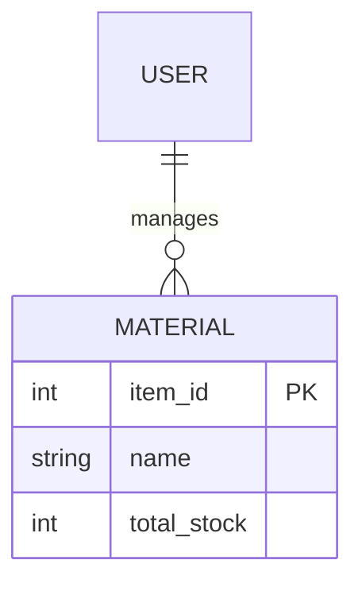
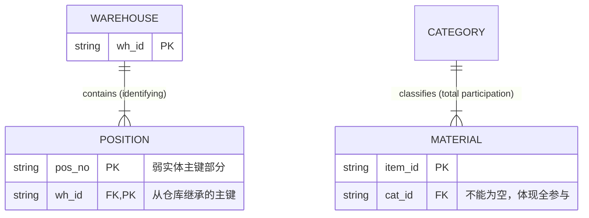

```mermaid
erDiagram
    %% 定义实体及其属性
    USER {
    }
    
    MATERIAL {
        int item_id PK
        string name
        int total_stock
    }

    %% 定义关系
    USER ||--o{ MATERIAL : "manages"
```

```mermaid
erDiagram
    WAREHOUSE ||--|{ POSITION : "contains (identifying)"
    CATEGORY ||--|{ MATERIAL : "classifies (total participation)"

    WAREHOUSE {
        string wh_id PK
    }
    POSITION {
        string pos_no PK "弱实体主键部分"
        string wh_id FK, PK "从仓库继承的主键"
    }
    MATERIAL {
        string item_id PK
        string cat_id FK "不能为空，体现全参与"
    }
```

|     |     |     |
| --- | --- | --- |
|     |     |     |
