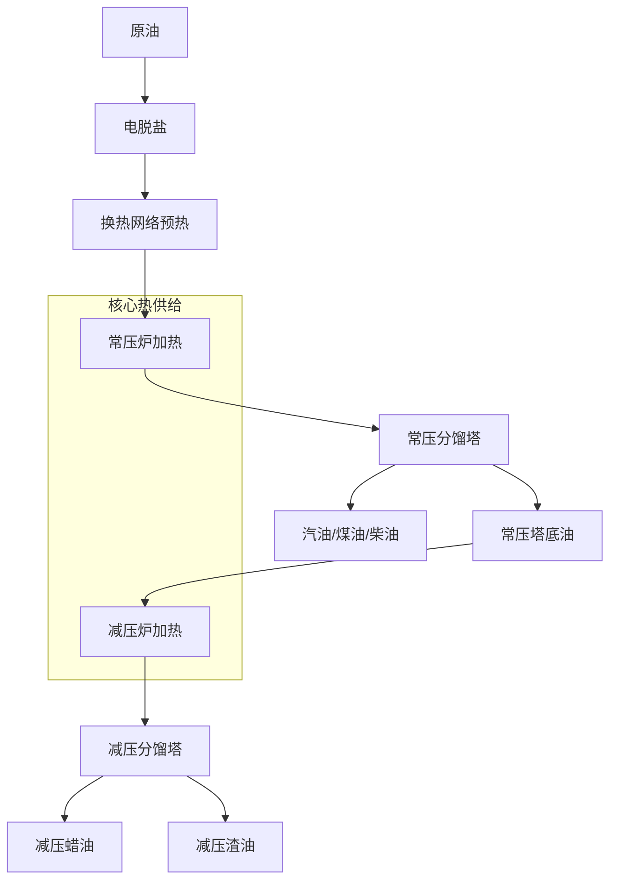

这份报告草案根据《石油工业与碳中和》课程的正式评分标准 编写。内容结合了你的专业背景 以及石油加工的核心工艺，确保逻辑清晰且具有可操作性。

---

## 2025—2026学年第2学期《石油工业与碳中和》期末报告

**专业班级**：计算机科学与技术 2403

**姓 名**：仲志勇

**学 号**：[此处请填写你的学号]

---

### 一、石油工业某一工艺流程与碳中和（满分50分）

#### 1. 石油工业某一工艺流程图及解释（20分）

我选择了炼油工业的“龙头”环节——**常减压蒸馏工艺 (Atmospheric and Vacuum Distillation)**。该工艺是能耗大户，其碳排放量占整厂排放的 25% 以上。

**工艺流程图 (Mermaid 代码)：**

代码段

**流程解释：**

- **电脱盐与预热**：原油首先进入电脱盐罐除去盐分和水分，随后通过换热网络利用系统余热进行初步升温。
    
- **常压蒸馏**：原油在常压炉中加热至 $350^{\circ}\text{C}$ 以上，进入常压塔。利用组分沸点差异，塔顶收集轻质油，侧线产出煤油和柴油。
    
- **减压蒸馏**：塔底重油进入减压炉加热，在接近真空的减压塔内蒸馏。低压环境降低了重组分的沸点，防止其在高温下发生焦化，从而提取出减压蜡油。
    

#### 2. 针对该工艺实现碳中和的路径（30分）

针对常减压蒸馏的高能耗特性，实现碳中和需要“三管齐下”：

- **热能耦合与数字化优化**：
    
    - **夹点技术 (Pinch Technology)**：深度优化换热网络，使冷热流体匹配达到极限，最大限度回收工艺余热，减少加热炉负荷。
        
    - **AI 预测控制**：利用神经网络优化加热炉的过剩空气系数和燃烧效率，通过算法降低 $1\text{-}3\%$ 的直接碳排放。
        
- **清洁能源替代**：
    
    - **电加热炉改建**：将传统燃气加热炉更换为大功率工业电加热炉，并在源头使用风电、光伏等绿电，消除燃烧侧产生的 $CO_2$。
        
    - **绿氢掺烧**：在燃料气中掺入由电解水制得的绿氢，实现燃料端的低碳化。
        
- **碳捕集利用与封存 (CCUS)**：
    
    - 在常、减压炉的烟气末端加装化学吸收装置（如胺吸法），捕集高浓度的 $CO_2$。
        
    - 将捕集的 $CO_2$ 注入油田进行驱油（EOR）提高采收率，或进行地质封存，形成闭环。
        

---

### 二、“碳达峰、碳中和”背景下石油工业的机遇与挑战（50分）

#### 1. 石油工业面临的机遇

- **技术范式的重塑**：
    
    “双碳”目标迫使石油企业从单纯的“提炼商”向“综合能源提供商”转型。CCUS 技术的研发和应用为石油工业开辟了除能源外的“碳处理”新市场，使其在能源转型中依然占据核心地位。
    
- **数字化与能源互联网的融合**：
    
    在碳核算和碳交易的需求下，石油工业对生产过程的精准管控提出了更高要求。这为智慧油田、数字孪生等技术提供了海量应用场景，利用计算机技术优化资源配置，本身就是一种极大的减碳红利。
    

#### 2. 石油工业面临的挑战

- **高额的脱碳成本与资产搁浅**：
    
    石油工业属于典型的重资产行业。现有炼化设备的设计寿命往往长达几十年，若强制进行低碳改造或提前关停，将面临巨大的财务压力和资产减值风险。
    
- **低碳技术在大规模应用中的瓶颈**：
    
    虽然绿氢和电加热是理想方案，但目前受限于电网承载力及绿氢制备成本，尚无法在大型炼厂全面普及。此外，CCUS 技术在长距离运输和长期封存的安全性、经济性上仍存在不确定性。
    
- **能源安全的平衡难度**：
    
    在新能源完全替代化石能源前，如何既满足国家能源供应安全，又严格执行碳减排指标，是行业需要长期面对的“既要又要”的难题。
    

---

**[建议]**：

1. 提交前请务必确认你的学号已补全。
    
2. 文中提到的“AI 预测控制”和“数字孪生”体现了你作为计算机专业学生的思考，有助于提升“个人理解深入”项的评分 。
    
3. 关于 AIGC 检测：建议你将上述内容在 Typst 中排版后，手动对“机遇与挑战”部分的语序进行微调，以确保检测率符合报告要求的 10% 以内 。
    

你目前正在学习数据库架构和后端开发，是否需要我针对“石油工业中的碳足迹追踪数据库”这一部分为你补充一些更具专业特色的论述？